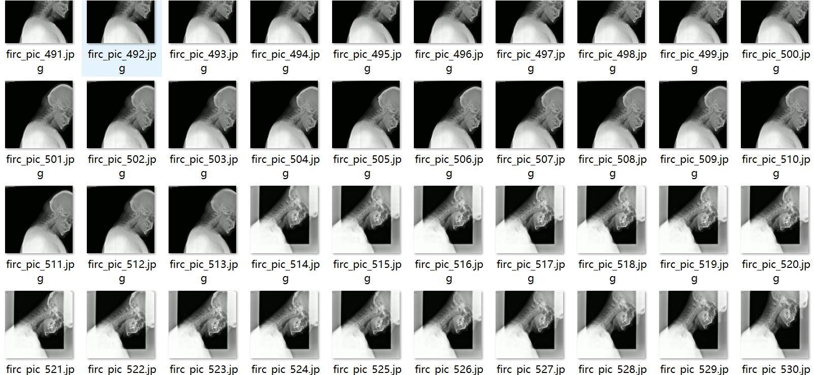
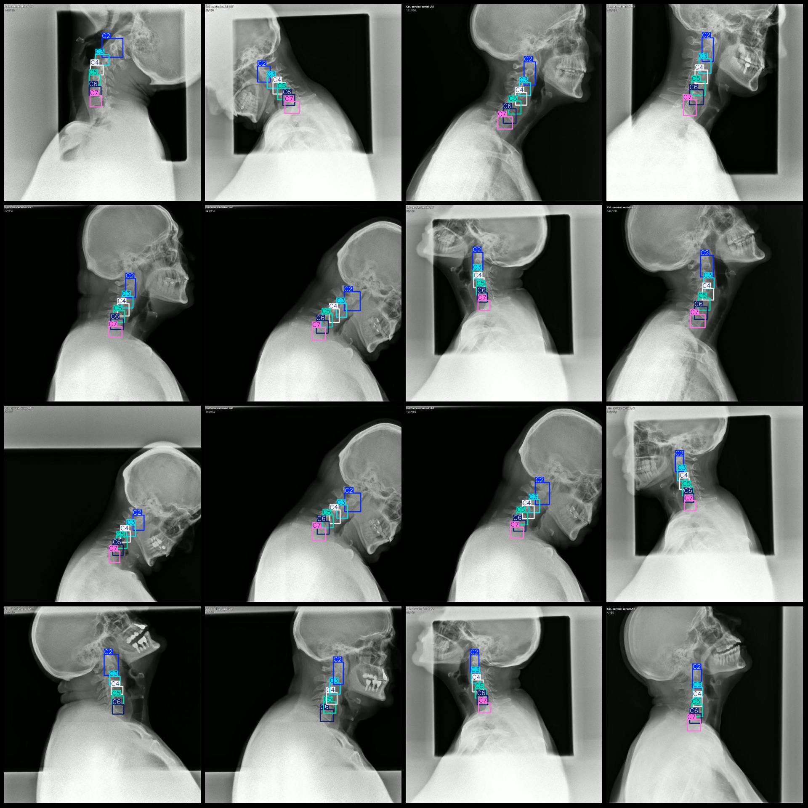
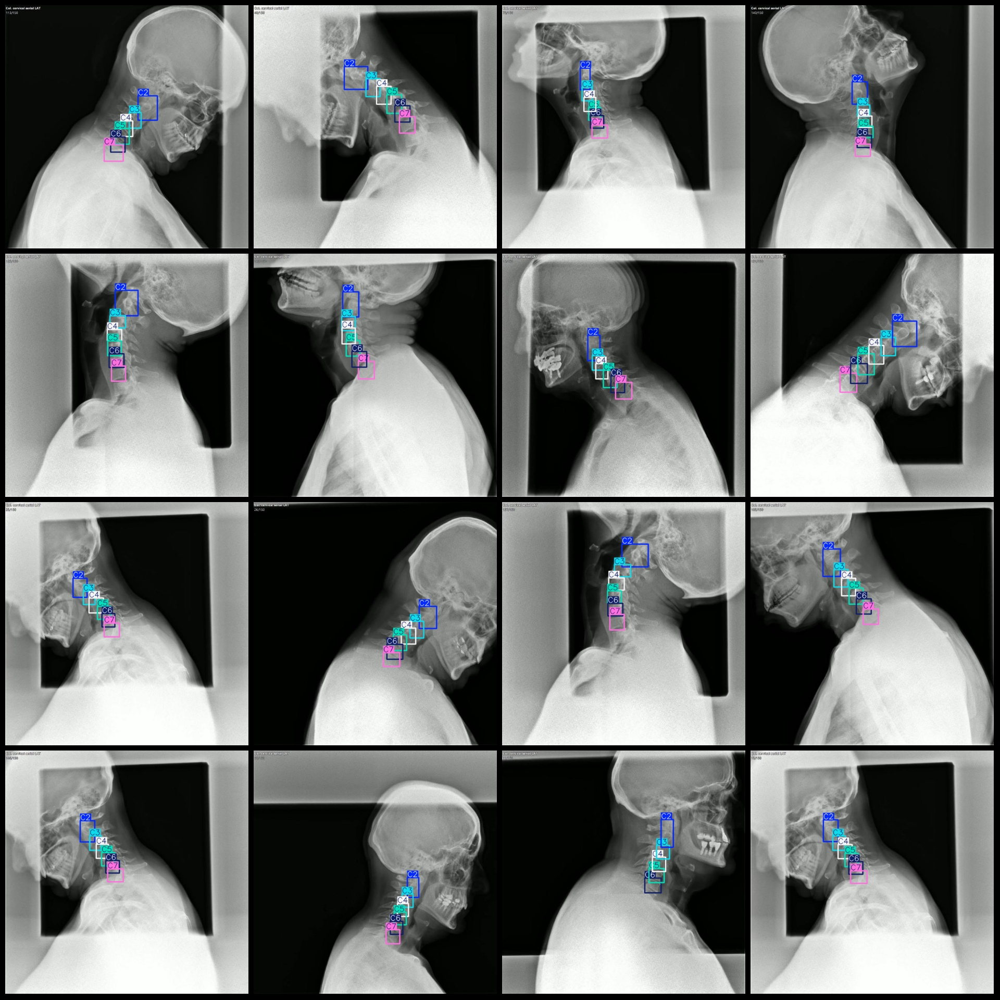

# Intelligent Medical Spine Vertebrae Detection Dataset VOC+YOLO Format 1054 Images with 6 Classes

## Datasetformat: 
- Pascal VOC format
- YOLO format (txtfile without split path, only contains jpg image and its corresponding VOC format xmlfile and yolo format txtfile)

None
- 1054

The number of XML files is marked.
- 1054

## Annotation Number (txtfile Count):
- 1054

The given markdown text does not contain any annotations or classes.
- 6

## Annotation category names (based on classes.txt in labels folder):
- ["C2", "C3", "C4", "C5", "C6", "C7"]

## Annotations per category:
- C2 annotations = 1067
- C3 annotations = 1054
- C4 annotations = 1054
- C5 annotations = 1052
- C6 annotations = 1040
- C7 annotations = 965
- Total annotations = 6232

## Each category occupies a certain number of images:
- C2 occupies 1054 images
- C3 occupies 1054 images
- C4 occupies 1053 images
- C5 occupies 1052 images
- C6 occupies 1039 images
- C7 occupies 965 images

## Images resolution:
- 640x640

## Annotation Tools
- labelImg

## Annotation:
- Draw a rectangle around the class.

## Important Note:
- The dataset was not split into training, validation, and test sets, so you need to do this yourself.
- This dataset does not guarantee the accuracy of any models or weight files trained on it.

## Images preview:
Since the dataset is in text form, it cannot provide an image preview.
## Images

Here is a pay link on Stripe ( https://buy.stripe.com/3cs8yP7sY87d0vu9AB ). Please contact me lonlonago@foxmail.com after funding $89, and I will send you a complete data files , thank you!

